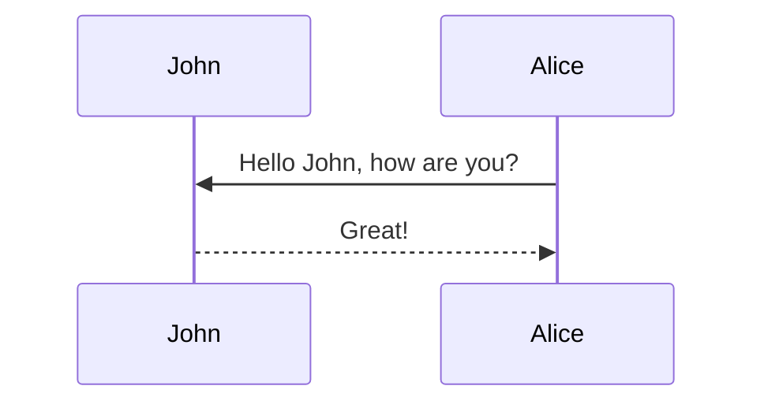

# amomorning.github.io

Personal academic page built using [al-folio](https://github.com/alshedivat/al-folio.git)

## Usage
### Environment
- [Ruby + Devkit](https://rubyinstaller.org/downloads/)
- Jekyll
- Bundle

``` bash
$ ridk install
# select 3
$ gem -v
# > 3.3.3

$ gem install jekyll bundler

$ jekyll -v
# > jekyll 4.2.1
```
### Install
``` bash
# shallow clone
$ git clone --depth 1 git@github.com:amomorning/amomorning.github.io.git
$ cd amomorning.github.io
$ bundle install
```

### Preview

Create a prebiew at http://127.0.0.1:4000.

``` bash
$ bundle exec jekyll serve
```

## More than markdown
### insert images
insert images is quite different with markdown:

``` liquid

<div class="caption">
 图1. ArchIndex 网页设计 （https://index.archialgo.com）
</div>
```

- `zoomable=true` medium zoom in page/post layout, not work in distill layout
- `class="z-depth-1"` shadow

Photo formatting is made simple using [Bootstrap's grid system](https://getbootstrap.com/docs/4.4/layout/grid/). Easily create beautiful grids within your blog posts and project pages:

``` liquid
<!-- 1/3 per image -->

<div class="row">
    <div class="col-sm mt-3 mt-md-0">
        
    </div>
    <div class="col-sm mt-3 mt-md-0">
        
    </div>
    <div class="col-sm mt-3 mt-md-0">
        
    </div>
</div>

<!-- 2/3 + 1/3 images -->
<div class="row justify-content-sm-center">
    <div class="col-sm-8 mt-3 mt-md-0">
        
    </div>
    <div class="col-sm-4 mt-3 mt-md-0">
        
    </div>
</div>
```

### refer to file in `_data` folder
Data files give you access information from `CSV`, `JSON` or `YAML` files on your Jekyll site. For example, the  `example.json` file: 
``` json
{
    "model": [{
            "filename": "1",
            "url": "https://model.amomorning.com/img/1.jpg"
        },
        {
            "filename": "2",
            "url": "https://model.amomorning.com/img/2.jpg"
        }
    ]
}
```

``` liquid
<!-- don't forget endfor -->

<h1>{{file.filename}}</h1>
<a href="{{file.url}}"> link </a>

```
### for loop
``` liquid
---
heading: I like cupcakes
show_heading: false
cupcakes:
  - chocolate
  - lemon
  - strawberry
---
...
<ul>

  <li>{{ cupcake }}</li>

</ul>
...

```
### if statement
- [Control flow statements in Liquid | CloudCannon Academy](https://learn.cloudcannon.com/jekyll/control-flow-statements-in-liquid/)


``` liquid
<!-- equal and not equal to -->




<!-- contains -->



<!-- if -->




<!-- unless -->



<!-- case -->











```
### mermaid diagram
The diagram below was generated by the following code:
``` liquid

sequenceDiagram
    participant John
    participant Alice
    Alice->>John: Hello John, how are you?
    John-->>Alice: Great!

```

### twitter card
#### Tweet
An example of displaying a tweet:

``` liquid

```


#### Timeline
An example of pulling from a timeline:


``` liquid

```

## Distill Layout
The theme allows you to create blog posts in the [distill.pub](https://distill.pub/) style:
### front matter

``` markdown
--- 
authors:
  - name: Yichen Mo
    url: https://amomorning.com
    affiliations:
      name: Southeast University
  - name: Baizhou Zhang
  - name: Biao Li

toc:
  - name: 引言
  - name: 方法
  - name: 技术细节
  - name: 应用展示

---

<!-- the content of the posts -->
```


## Categories

### News
The recent update at **about** is in the  `_news` folder, includes **inline posts** and **long posts**
#### Inline posts
``` markdown
---
layout: post
date: 2021-03-30 11:00:00-0400
inline: true
---
```
#### Long posts

``` markdown
---
layout: post
title: Present "ArchIndex A Web-based and Data-driven Retrieval System for City Blocks" at CUPUM 2021
date: 2021-06-13 16:11:00-0400
inline: false
---

<!-- the content of the posts -->

````

### Publications
publications page is generated automatically from your BibTex bibliography. Simply edit `_bibliography/papers.bib`. You can also add new `*.bib` files and customize the look of your publications however you like by editing `_pages/publications.md`

#### Author
In publications, the author entry for yourself is identified by string `scholar:last_name` and string array `scholar:first_name` in `_config.yml`:

``` yml
scholar:
  last_name: Einstein
  first_name: [Albert, A.]
```
#### Coauthor
Keep meta-information about your co-authors in `_data/coauthors.yml` and Jekyll will insert links to their webpages automatically. 

``` yml
"lastname | family name":
  - firstname: ["name", "f."]
    url: link to personal website

  - firstname: ["another author", "a"]
    url: link to personal website


"Mo":
  - firstname: ["Yichen", "Y."]
    url: https://amomorning.github.io
```
#### Entry Keys
所有的文献放在 `bibliography` 目录当中的 `paper.bib` 文件内。一开始尝试了从 Zotero 导出，结果在网页上显示不大好，如果自己填了 entry 还会被覆盖掉，所以还是需要手填的。

有时间或许应该考虑自己写个....

- `title` 文章目录
- `author` 作者列表
- 文献类型
	- article 期刊
		- `journal` 
	- inproceedings 会议
		- `booktitle`
	- thesis
		- 不需要填 title 和 author ？
- `abstract`  摘要内容
- `bibtex_show` 显示该文献的 bibtex
- 链接
	- `arxiv` arxiv 地址，entry内填arxiv编号
	- `blog` blog 地址，http
	- `code` 论文相关的代码位置，http
	- `website` 论文网页
	- `video` 视频链接（自定义）
- 文件
	- `pdf` pdf文件，需手动放到 `asset/pdf/` ；也可填 http 或 ftp 链接
	- `supp` 论文的 supplyments，需手动放到 `asset/pdf/` ；也可填 http 或 ftp 链接
	- `poster` poster，需手动放到 `asset/pdf/` ；也可填 http 或 ftp 链接
	- `slides` slides，需手动放到 `asset/pdf/` ；也可填 http 或 ftp 链接
## License

The theme is available as open source under the terms of the [MIT License](https://opensource.org/licenses/MIT).
